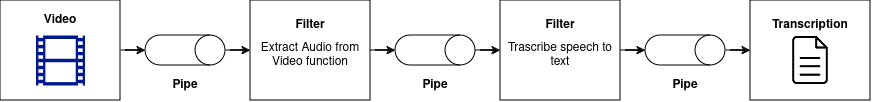

# Transcribe Audio to Text with Pipes-and-Filters pattern

## Description


This project is a simple example of the Pipes-and-Filters pattern. 
First, it extracts the audio from a video file formatted `.mp4` using FFmpeg. 
Then, it transcribes the audio to text using AssemblyAI Speech-to-Text API. 
The text is finally saved to a file `.txt`.

## Guideline

### 1. Install FFmpeg (extract the audio)
```
sudo apt update && sudo apt upgrade
sudo apt install ffmpeg
```
To verify the Installation:
```
ffmpeg -version
```

### 2. Clone config.yml from config.tmp.yml
```
api_key: "API_KEY_FROM_DOC"
files:
  audio_files:
    - "audio.mp3"
  video_files:
    - "video.mp4"
  text_files:
    - "text.txt"
```
[Link doc](https://docs.google.com/document/d/1ZD19IvNdWFU6cACiYj5s9yAKadfcLu0A78bBGOyuEjY/edit?usp=sharing)

### 3. Run the project
```
make run
```